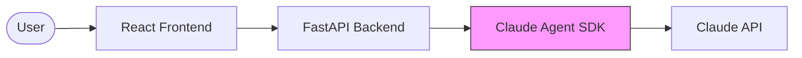
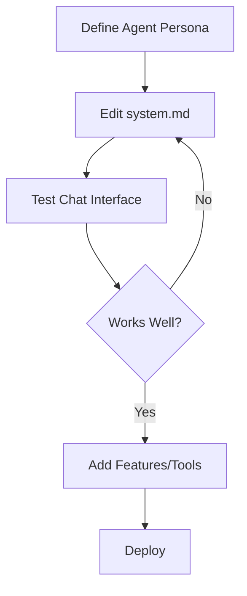

# Solo Agent Agile Template

A full-stack template for building **AI Agents powered by Claude Agent SDK**.

Create your own branded Agent ("XX Agent") with a web interface, using Claude Agent SDK as the underlying engine.

## Architecture



**Key Insight**: Instead of calling Claude API directly, this template uses **Claude Agent SDK** as the agent engine. This gives you:

- Built-in agentic capabilities (code execution, file operations)
- Multi-turn reasoning out of the box
- Tool use without custom implementation
- Streaming responses

## Tech Stack

- **Frontend**: React 18 + Vite + Tailwind CSS (managed by Bun)
- **Backend**: FastAPI + SQLAlchemy + PostgreSQL
- **Agent Engine**: Claude Agent SDK

## Quick Start

```bash
# 1. Clone or copy this template
git clone [template-url] my-agent
cd my-agent

# 2. Initialize project
chmod +x init-project.sh
./init-project.sh "MyAgent"

# 3. Set up environment
cp backend/.env.example backend/.env
# Edit backend/.env and add your ANTHROPIC_API_KEY

# 4. Install dependencies & run (includes Claude Agent SDK)
make install
make db-start
make dev

# Frontend: http://localhost:3000
# Backend:  http://localhost:8000
```

## Project Structure

```
my-agent/
|-- frontend/                 # React Chat Interface
|   |-- src/
|   |   |-- components/
|   |   |   |-- chat/        # Chat UI components
|   |   |-- hooks/
|   |   |   |-- useChat.ts   # SSE streaming hook
|   |   |-- pages/
|       |-- HomePage.tsx # Main chat page
|
|-- backend/                  # FastAPI + Claude Agent SDK
|   |-- src/
|   |   |-- modules/
|   |   |   |-- agent/       # Agent engine
|   |   |   |   |-- driver.py    # Claude SDK driver
|   |   |   |   |-- service.py   # Agent service
|   |   |   |   |-- prompts/     # System prompts
|   |   |   |-- chat/        # Chat API routes
|
|-- docs/                     # Documentation
|-- epics/                    # Feature planning
|-- .claude/                  # Claude Code commands
```

## Customizing Your Agent

### 1. Edit System Prompt

The most important file - defines your agent's personality:

```bash
backend/src/modules/agent/prompts/system.md
```

### 2. Configure Capabilities

In `backend/src/modules/agent/service.py`:

```python
# Restrict which tools your agent can use
agent_service.set_allowed_tools([
    "Read",      # Read files
    "Write",     # Write files
    "Bash",      # Run commands
    # ... see Claude Agent SDK docs for full list
])
```

### 3. Add Personas

Create persona files for different agent personalities:

```bash
backend/src/modules/agent/prompts/persona_friendly.md
backend/src/modules/agent/prompts/persona_expert.md
```

Switch personas via API:

```bash
curl -X POST http://localhost:8000/api/chat/admin/set-persona?persona=friendly
```

## API Endpoints

| Endpoint | Method | Description |
|----------|--------|-------------|
| `/api/chat/message` | POST | Send message (SSE stream) |
| `/api/chat/message/sync` | POST | Send message (wait for full response) |
| `/api/chat/sessions` | POST | Create new session |
| `/api/chat/sessions/{id}` | DELETE | End session |
| `/api/chat/admin/reload-prompt` | POST | Reload system prompt |
| `/api/chat/admin/set-persona` | POST | Switch persona |

### Example: Send Message

```javascript
// Using fetch with SSE
const response = await fetch('/api/chat/message', {
  method: 'POST',
  headers: { 'Content-Type': 'application/json' },
  body: JSON.stringify({
    message: 'Hello!',
    session_id: 'optional-session-id'
  })
});

// Read SSE stream
const reader = response.body.getReader();
// ... handle streaming events
```

## Claude Commands

### Core Commands (Daily Use)

| Command | Description |
|---------|-------------|
| `/project:context` | Load full work context |
| `/project:context standup` | Generate standup report (Yesterday/Today/Blockers) |
| `/project:context brief` | Quick status check |
| `/project:next` | Get next recommended task |
| `/project:done "msg"` | Mark task complete |
| `/project:done "msg" --log "notes"` | Mark complete + record session notes |
| `/project:done "msg" --doc` | Mark complete + update related docs |
| `/project:plan "feature"` | Break down feature into tasks |
| `/project:plan "question" --design` | Architecture design perspective |
| `/project:plan "feature" --full` | Full analysis (design + tasks) |

### Auxiliary Commands (As Needed)

| Command | Description |
|---------|-------------|
| `/project:init "description"` | Initialize new project |
| `/project:init epic "name"` | Create new Epic |
| `/project:debug "issue"` | Systematic debugging help |
| `/project:review` | Code review current changes |
| `/project:module [name]` | Load specific module context |

---

## From Zero to Production: Complete Workflow Example

This section demonstrates how to build a project from scratch using the template commands.

### Phase 1: Project Initialization

```bash
# Step 1: Clone template and enter directory
git clone [template-url] my-habit-tracker
cd my-habit-tracker

# Step 2: Use Claude/cursor to initialize project
/project:init I want to build a habit tracking app called HabitFlow.
Target users are individuals who want to build good habits.
Core features: habit creation, daily check-ins, streak tracking, weekly summary.
Need user authentication. Launch in 2 months.
```

Claude/cursor will:
- Ask clarifying questions if needed
- **Design system architecture** in `docs/ARCHITECTURE.md`
- Update `CLAUDE.md` with project context
- Create `ROADMAP.md` with MVP plan
- Design domain model in `docs/DOMAIN.md`
- Initialize `STATUS.md`
- Create first Epic in `epics/01-xxx/`

### Phase 2: Daily Development Cycle

```bash
# Start of each session - load context
/project:context

# Output example:
# ## Current Context
# **Epic**: 01 - User Authentication
# **Task**: Implement JWT token generation
# **Last Session**: Set up user model and database schema
# **Blockers**: None
#
# ## Ready to Continue
# Next step: Create auth service with login/register endpoints

# Get specific task recommendation
/project:next

# Output example:
# ### Next Task
# **Epic**: 01 - User Authentication
# **Task ID**: 1.3
# **Task**: Implement JWT token generation
# **Priority**: This unblocks frontend login
#
# ### Getting Started
# 1. Create backend/src/modules/auth/service.py
# 2. Add JWT dependencies to requirements.txt
# 3. Implement generate_token() and verify_token()
```

### Phase 3: Completing Tasks

```bash
# After finishing a task - basic completion
/project:done "Implemented JWT auth service with login/register"

# With session notes (recommended for complex tasks)
/project:done "Implemented JWT auth" --log "Used PyJWT library, tokens expire in 24h. 
Remember: refresh token logic still needed for Phase 2"

# With documentation update (for API changes, architecture decisions)
/project:done "Added /auth/login endpoint" --doc
```

### Phase 4: Planning New Features

```bash
# When you have a new feature idea - get task breakdown
/project:plan "Add streak tracking - users should see their current streak 
and get notifications when about to break it"

# Output example:
# ## Task Breakdown
#
# ### Phase 1: Backend Foundation
# | Task | Dependencies |
# |------|--------------|
# | 1.1 Create streak model | None |
# | 1.2 Add streak calculation service | 1.1 |
#
# ### Phase 2: API & Frontend
# | Task | Dependencies |
# |------|--------------|
# | 2.1 Create streak API endpoints | Phase 1 |
# | 2.2 Add streak UI component | 2.1 |

# For complex features - get architecture design first
/project:plan "How should I implement the notification system?" --design

# For complete analysis (design + tasks)
/project:plan "Payment integration for premium features" --full
```

### Phase 5: Creating New Epics

```bash
# After planning, create a new Epic
/project:init epic "Streak Tracking System"

# Claude will:
# - Create epics/02-streak-tracking/
# - Generate EPIC.md with goals and stories
# - Create tasks.md from your plan
# - Update ROADMAP.md
```

### Phase 6: Standup & Progress Tracking

```bash
# Generate standup report for team sync
/project:context standup

# Output example:
# ## Standup Report
#
# ### Yesterday/Last Session
# - Completed JWT auth service
# - Added login/register endpoints
# - Fixed token expiration bug
#
# ### Today/This Session
# - [ ] Add password reset flow
# - [ ] Create auth middleware
#
# ### Blockers
# - Waiting for email service credentials
#
# ---
# ### Progress Overview
# **Current Epic**: 01 - User Authentication
# [########--] 80% (8/10 tasks)
#
# **Target Date**: 2024-03-15 | **On Track**: Yes
```

### Phase 7: Debugging Issues

```bash
# When you encounter a bug
/project:debug "Login returns 401 even with correct credentials"

# Claude will guide you through:
# 1. Understanding expected vs actual behavior
# 2. Common causes checklist
# 3. Isolation steps
# 4. Debug commands to run
# 5. Solution and test verification
```

### Phase 8: Code Review

```bash
# Before committing - review changes
/project:review

# Claude will check:
# - Code standards and conventions
# - Patterns and anti-patterns
# - Test coverage
# - Security considerations
# - Performance concerns
```

---

### Complete Day-in-the-Life Example

```bash
# Morning - Start work
/project:context brief
# Quick Status: Epic 01 (80%), Task: Add password reset, Status: Ready

# Load full context
/project:context
# ... review what was done and what's next

# Get task details
/project:next
# Task 1.8: Implement password reset flow

# ... work on the task ...

# Lunch break - mark progress
/project:done "Added password reset email sending" --log "Used SendGrid API, 
rate limited to 100/hour. Token expires in 1 hour."

# Afternoon - continue
/project:next
# Task 1.9: Add password reset UI

# ... complete the task ...

# End of day - final update
/project:done "Completed password reset flow" --doc

# Check overall progress
/project:context standup
# Ready for tomorrow's standup!
```

---

## Development Workflow



## Environment Variables

| Variable | Description | Default |
|----------|-------------|---------|
| `ANTHROPIC_API_KEY` | Your Anthropic API key | (required) |
| `CLAUDE_MODEL` | Model to use: sonnet/opus/haiku | sonnet |
| `AGENT_WORKSPACE_DIR` | Where Claude SDK runs | /tmp/agent_workspaces |
| `AGENT_MAX_TURNS` | Max agentic turns | 10 |
| `AGENT_TIMEOUT` | Request timeout (seconds) | 300 |
| `AGENT_PERMISSION_MODE` | SDK permission mode | acceptEdits |

## Security Considerations

1. **Workspace Isolation**: Each session runs in its own directory
2. **Tool Restrictions**: Limit which tools are available
3. **Timeout Limits**: Prevent runaway processes
4. **Input Validation**: Sanitize user messages

## Deployment

See `docs/DEPLOY.md` for deployment guides.

Key considerations:
- Claude Agent SDK must be installed (`pip install claude-agent-sdk`)
- Ensure adequate disk space for workspaces
- Configure cleanup for old session workspaces

## License

MIT License
