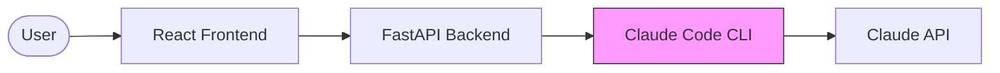
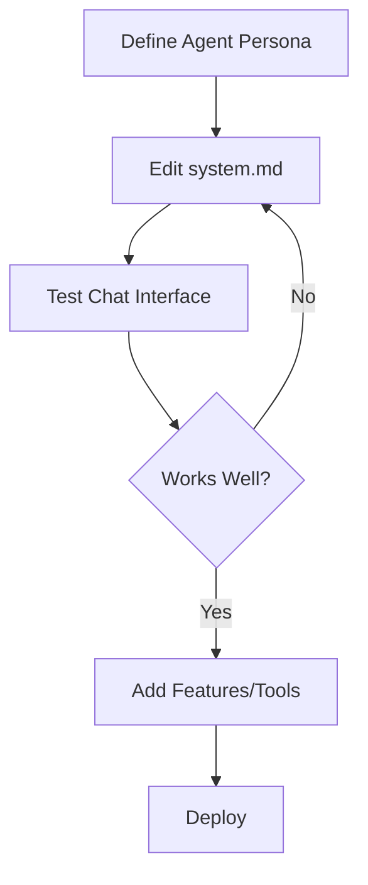

# Solo Agent Agile Template

A full-stack template for building **AI Agents powered by Claude Code**.

Create your own branded Agent ("XX Agent") with a web interface, using Claude Code as the underlying engine.

## Architecture



**Key Insight**: Instead of calling Claude API directly, this template uses **Claude Code CLI** as the agent engine. This gives you:

- Built-in agentic capabilities (code execution, file operations)
- Multi-turn reasoning out of the box
- Tool use without custom implementation
- Streaming responses

## Tech Stack

- **Frontend**: React 18 + Vite + Tailwind CSS (managed by Bun)
- **Backend**: FastAPI + SQLAlchemy + PostgreSQL
- **Agent Engine**: Claude Code CLI

## Quick Start

```bash
# 1. Clone or copy this template
git clone [template-url] my-agent
cd my-agent

# 2. Initialize project
chmod +x init-project.sh
./init-project.sh "MyAgent"

# 3. Install Claude Code CLI (required!)
npm install -g @anthropic-ai/claude-code

# 4. Set up environment
cp backend/.env.example backend/.env
# Edit backend/.env and add your ANTHROPIC_API_KEY

# 5. Install dependencies & run
make install
make db-start
make dev

# Frontend: http://localhost:3000
# Backend:  http://localhost:8000
```

## Project Structure

```
my-agent/
|-- frontend/                 # React Chat Interface
|   |-- src/
|   |   |-- components/
|   |   |   |-- chat/        # Chat UI components
|   |   |-- hooks/
|   |   |   |-- useChat.ts   # SSE streaming hook
|   |   |-- pages/
|   |       |-- HomePage.tsx # Main chat page
|
|-- backend/                  # FastAPI + Claude Code
|   |-- src/
|   |   |-- modules/
|   |   |   |-- agent/       # Agent engine
|   |   |   |   |-- driver.py    # Claude Code driver
|   |   |   |   |-- service.py   # Agent service
|   |   |   |   |-- prompts/     # System prompts
|   |   |   |-- chat/        # Chat API routes
|
|-- docs/                     # Documentation
|-- epics/                    # Feature planning
|-- .claude/                  # Claude Code commands
```

## Customizing Your Agent

### 1. Edit System Prompt

The most important file - defines your agent's personality:

```bash
backend/src/modules/agent/prompts/system.md
```

### 2. Configure Capabilities

In `backend/src/modules/agent/service.py`:

```python
# Restrict which tools your agent can use
agent_service.set_allowed_tools([
    "Read",      # Read files
    "Write",     # Write files
    "Bash",      # Run commands
    # ... see Claude Code docs for full list
])
```

### 3. Add Personas

Create persona files for different agent personalities:

```bash
backend/src/modules/agent/prompts/persona_friendly.md
backend/src/modules/agent/prompts/persona_expert.md
```

Switch personas via API:

```bash
curl -X POST http://localhost:8000/api/chat/admin/set-persona?persona=friendly
```

## API Endpoints

| Endpoint | Method | Description |
|----------|--------|-------------|
| `/api/chat/message` | POST | Send message (SSE stream) |
| `/api/chat/message/sync` | POST | Send message (wait for full response) |
| `/api/chat/sessions` | POST | Create new session |
| `/api/chat/sessions/{id}` | DELETE | End session |
| `/api/chat/admin/reload-prompt` | POST | Reload system prompt |
| `/api/chat/admin/set-persona` | POST | Switch persona |

### Example: Send Message

```javascript
// Using fetch with SSE
const response = await fetch('/api/chat/message', {
  method: 'POST',
  headers: { 'Content-Type': 'application/json' },
  body: JSON.stringify({
    message: 'Hello!',
    session_id: 'optional-session-id'
  })
});

// Read SSE stream
const reader = response.body.getReader();
// ... handle streaming events
```

## Claude Commands

| Command | Description |
|---------|-------------|
| `/project:init` | Initialize project based on requirements |
| `/project:context` | Load current work context |
| `/project:next` | Get next recommended task |
| `/project:done "msg"` | Mark task complete |
| `/project:prompt` | Work on agent prompts |

## Development Workflow



## Environment Variables

| Variable | Description | Default |
|----------|-------------|---------|
| `ANTHROPIC_API_KEY` | Your Anthropic API key | (required) |
| `CLAUDE_MODEL` | Model to use: sonnet/opus/haiku | sonnet |
| `AGENT_WORKSPACE_DIR` | Where Claude Code runs | /tmp/agent_workspaces |
| `AGENT_MAX_TURNS` | Max agentic turns | 10 |
| `AGENT_TIMEOUT` | Request timeout (seconds) | 300 |

## Security Considerations

1. **Workspace Isolation**: Each session runs in its own directory
2. **Tool Restrictions**: Limit which tools are available
3. **Timeout Limits**: Prevent runaway processes
4. **Input Validation**: Sanitize user messages

## Deployment

See `docs/operations/DEPLOY.md` for deployment guides.

Key considerations:
- Claude Code CLI must be installed on the server
- Ensure adequate disk space for workspaces
- Configure cleanup for old session workspaces

## License

[Your License]
