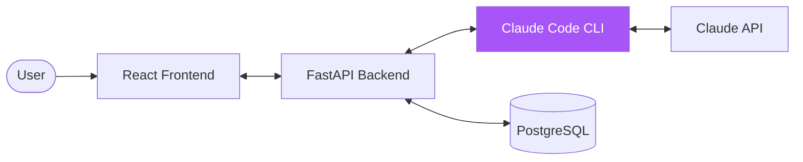
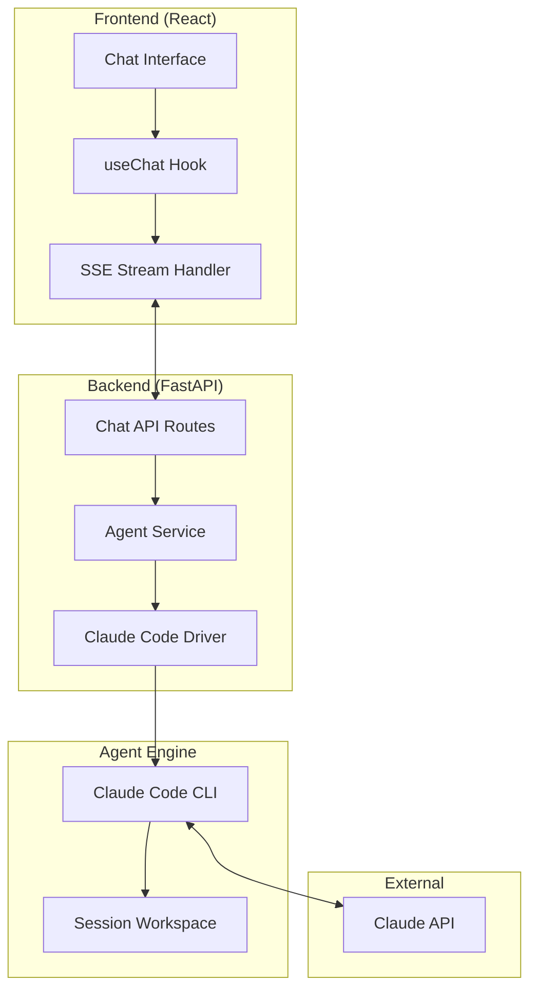
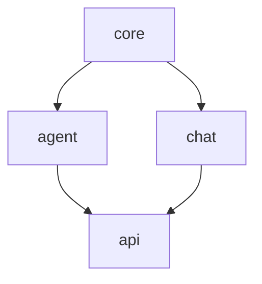
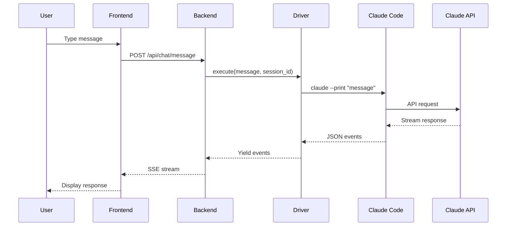
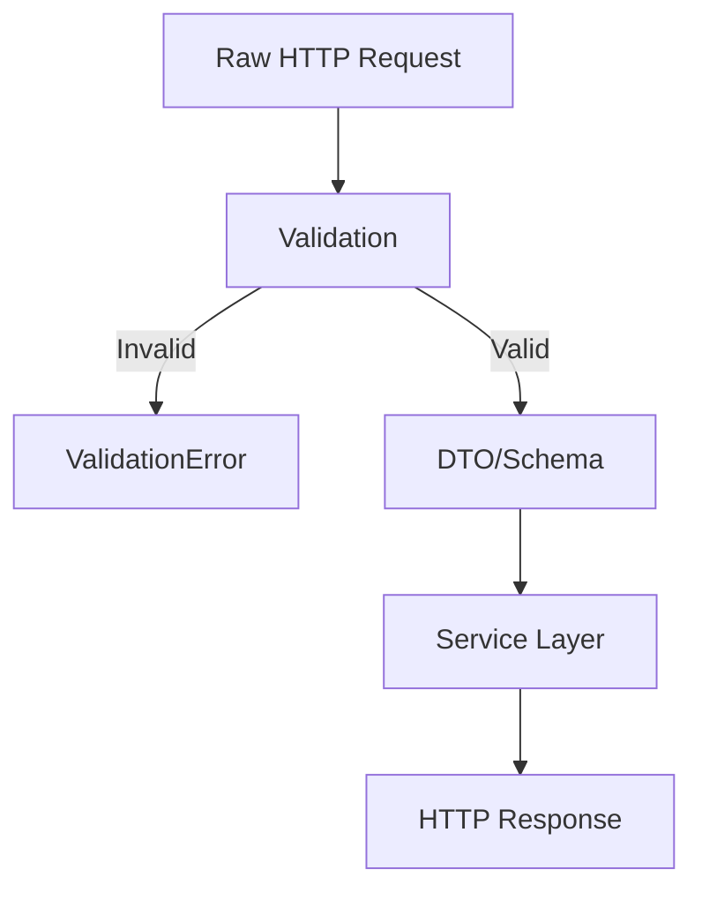
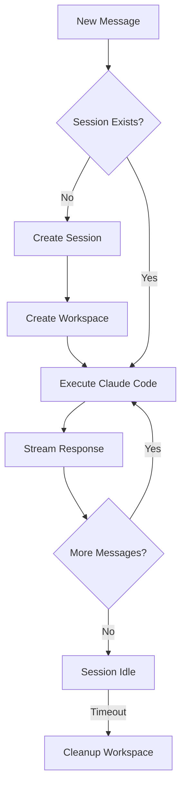
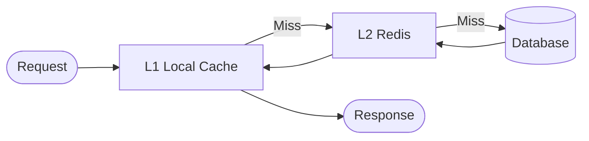
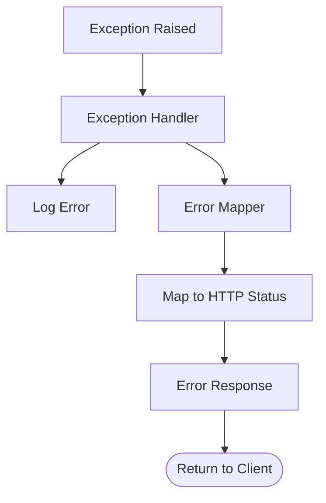

# Architecture

> Merged from: OVERVIEW.md, MODULES.md, DATA_FLOW.md

---

## System Context



## High-Level Architecture



---

## Component Details

### Frontend Components

| Component | Location | Purpose |
|-----------|----------|---------|
| ChatWindow | `components/chat/ChatWindow.tsx` | Main chat container |
| ChatMessage | `components/chat/ChatMessage.tsx` | Message bubble |
| ChatInput | `components/chat/ChatInput.tsx` | Input field |
| useChat | `hooks/useChat.ts` | SSE streaming hook |

### Backend Modules

| Module | Location | Purpose |
|--------|----------|---------|
| Agent Driver | `modules/agent/driver.py` | Executes Claude Code CLI |
| Agent Service | `modules/agent/service.py` | Manages prompts & sessions |
| Chat Router | `modules/chat/router.py` | API endpoints |

---

## Module Architecture

### Module Dependency Graph



### Module Registry

| Module | Location | Responsibility | Status |
|--------|----------|----------------|--------|
| core | `src/modules/core` | Shared domain primitives | Stable |
| agent | `src/modules/agent` | Claude Code integration | Stable |
| chat | `src/modules/chat` | Chat API routes | Stable |

### Cross-Module Communication

**Allowed Patterns:**

1. **Direct Import** (within same layer):
   ```python
   from modules.agent.service import agent_service
   ```

2. **Interface/Protocol** (cross-layer):
   ```python
   from modules.agent.interface import IAgentService
   ```

**Forbidden Patterns:**
- Direct database access from presentation layer
- Circular dependencies between modules
- Importing internal implementation details

### Adding a New Module

1. Create directory: `src/modules/[name]/`
2. Add required files: `__init__.py`, `service.py`
3. Register in module registry above
4. Update dependency graph if needed

---

## Request Flow



---

## Data Flow

### Message Format

```typescript
interface ChatMessage {
  id: string;
  role: 'user' | 'assistant';
  content: string;
  timestamp: Date;
  toolUse?: {
    tool: string;
    input: object;
    output?: string;
  }[];
}
```

### SSE Events

```
event: text
data: {"type": "text", "content": "Hello..."}

event: tool_use
data: {"type": "tool_use", "tool": "Bash", "input": {"command": "ls"}}

event: tool_result
data: {"type": "tool_result", "tool": "Bash", "output": "file1 file2"}

event: done
data: {"type": "done"}
```

### Data Transformation



---

## Session Management



---

## Security Considerations

### Workspace Isolation

Each session runs in an isolated directory:

```
/tmp/agent_workspaces/
├── session-uuid-1/
├── session-uuid-2/
└── session-uuid-3/
```

### Tool Restrictions

Control which Claude Code tools are available:

```python
allowed_tools = [
    "Read",      # Read files
    "Write",     # Write files
    "Bash",      # Run commands
    # Omit dangerous tools
]
```

### Timeouts

- Request timeout: 5 minutes default
- Max turns: 10 iterations
- Session cleanup: automatic on end

---

## Scaling Considerations

### Current Limits

- One Claude Code process per request
- Workspace disk usage per session
- API rate limits

### Future Scaling

- Session pooling
- Workspace caching
- Distributed execution

---

## Caching Strategy (if applicable)



| Pattern | TTL | Invalidation |
|---------|-----|--------------|
| `session:{id}` | 1h | On session end |
| `config:*` | 24h | Manual refresh |

---

## Error Handling Flow



### Error Response Format

```json
{
  "error": {
    "code": "ERROR_CODE",
    "message": "Human readable message",
    "details": {}
  }
}
```
