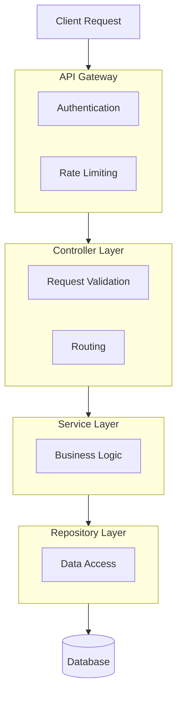
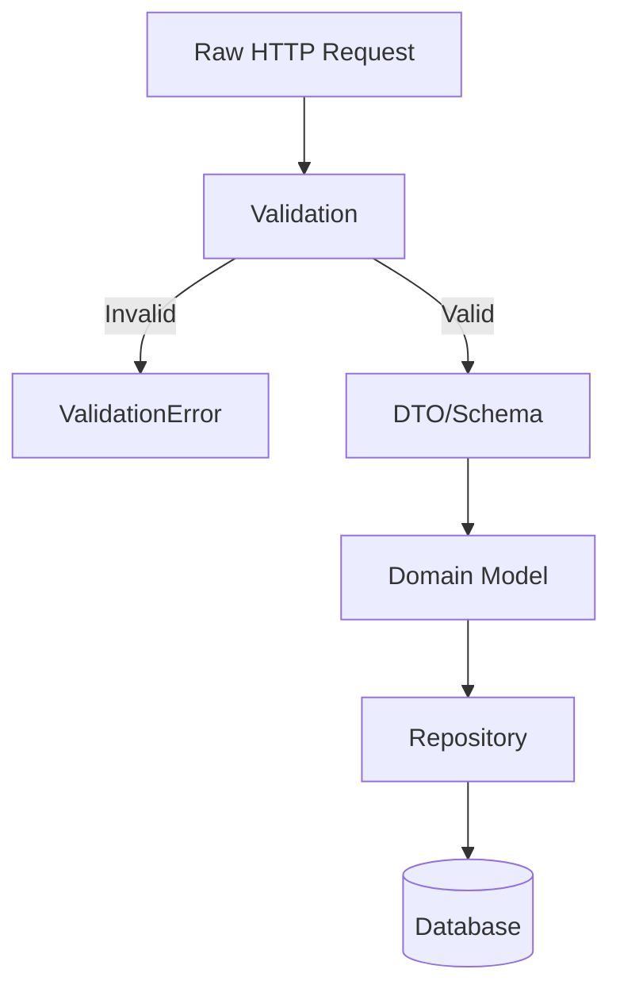
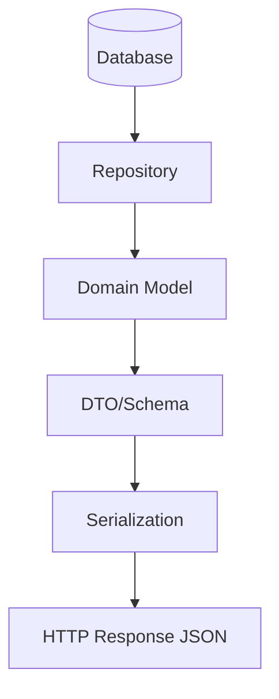
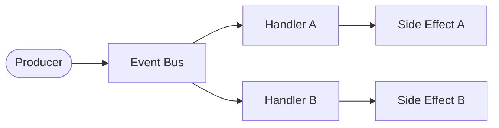
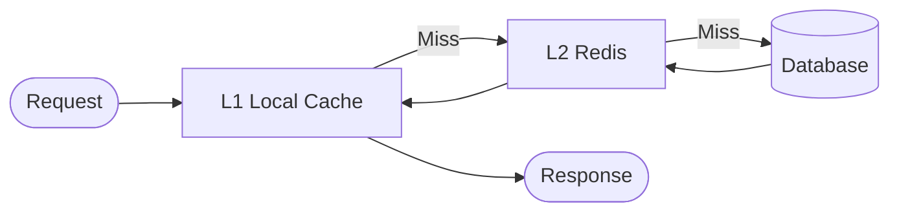
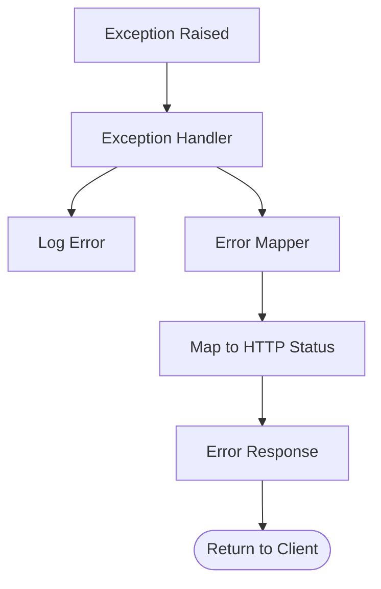

# Data Flow Architecture

## Request/Response Flow

### Typical API Request



---

## Data Transformation

### Input Flow



### Output Flow



---

## Event Flow (if applicable)



### Event Types

| Event | Producer | Consumers | Payload |
|-------|----------|-----------|---------|
| `user.created` | UserService | EmailService, AnalyticsService | `{user_id, email}` |
| `order.completed` | OrderService | InventoryService, NotificationService | `{order_id, items}` |

---

## External Integrations

### Outbound

| Service | Purpose | Data Sent | Frequency |
|---------|---------|-----------|-----------|
| [Service Name] | [Purpose] | [Data types] | [Sync/Async, rate] |

### Inbound

| Source | Purpose | Data Received | Handler |
|--------|---------|---------------|---------|
| [Source] | [Purpose] | [Data types] | [Handler location] |

---

## Caching Strategy

### Cache Layers



### Cache Keys

| Pattern | TTL | Invalidation |
|---------|-----|--------------|
| `user:{id}` | 1h | On user update |
| `config:*` | 24h | Manual refresh |

---

## Error Handling Flow



### Error Response Format

```json
{
  "error": {
    "code": "VALIDATION_ERROR",
    "message": "Human readable message",
    "details": {}
  }
}
```
