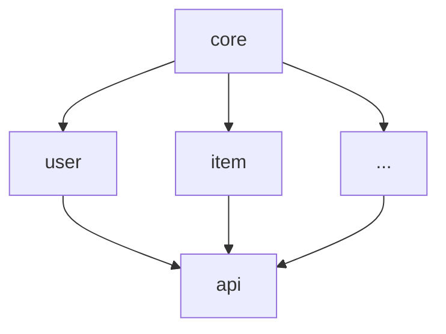

# Module Architecture

## Module Dependency Graph



---

## Module Registry

| Module | Location | Responsibility | Status |
|--------|----------|----------------|--------|
| core | `src/modules/core` | Shared domain primitives | Stable |
| user | `src/modules/user` | User management | Stable |
| [name] | `src/modules/[name]` | [Description] | [Status] |

---

## Module Details

### core

**Location**: `src/modules/core`
**Status**: Stable
**Owner**: [Name/Team]

**Responsibility**:
- Shared base classes and interfaces
- Common utilities
- Cross-cutting concerns

**Depends on**: Nothing (leaf module)
**Depended by**: All other modules

---

### user

**Location**: `src/modules/user`
**Status**: Stable

**Responsibility**:
- User registration and authentication
- Profile management
- Session handling

**Depends on**: `core`
**Depended by**: `api`, [others]

**Key Files**:
- `service.py` - Main service entry
- `models.py` - Domain models
- `repository.py` - Data access

---

### [module_name]

**Location**: `src/modules/[name]`
**Status**: [Development/Stable/Deprecated]

**Responsibility**:
- [What this module does]

**Depends on**: [list]
**Depended by**: [list]

**Key Files**:
- [file] - [purpose]

---

## Cross-Module Communication

### Allowed Patterns

1. **Direct Import** (within same layer):
   ```python
   from modules.user.service import UserService
   ```

2. **Interface/Protocol** (cross-layer):
   ```python
   from modules.user.interface import IUserService
   ```

3. **Events** (async/decoupled):
   ```python
   events.publish("user.created", user_id=...)
   ```

### Forbidden Patterns

- Direct database access from presentation layer
- Circular dependencies between modules
- Importing internal implementation details

---

## Adding a New Module

1. Create directory: `src/modules/[name]/`
2. Add required files:
   - `__init__.py`
   - `MODULE.md` (copy from `_template`)
   - `INTERFACE.md`
   - `service.py`
3. Register in this document
4. Update dependency graph if needed
