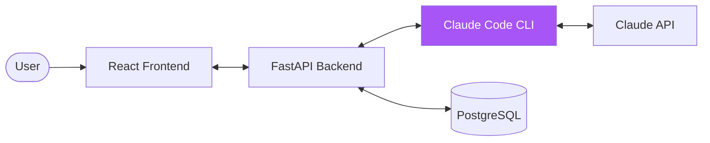
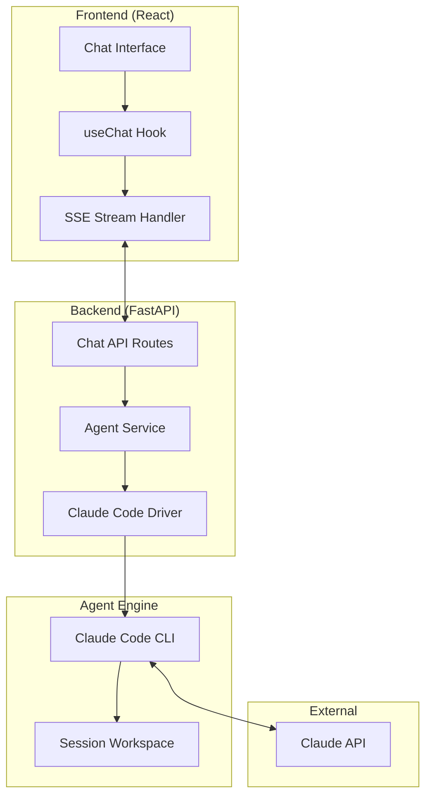
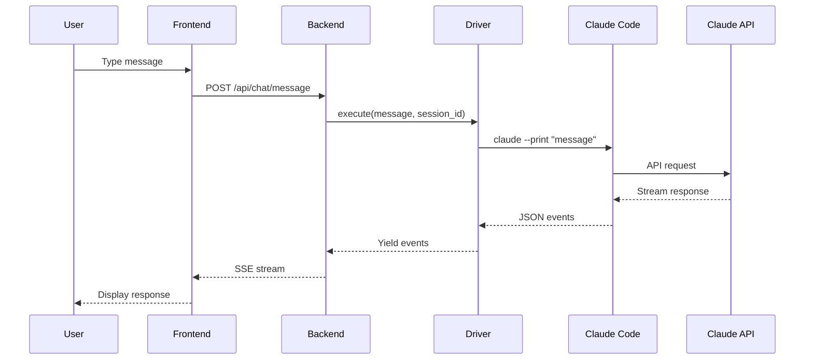
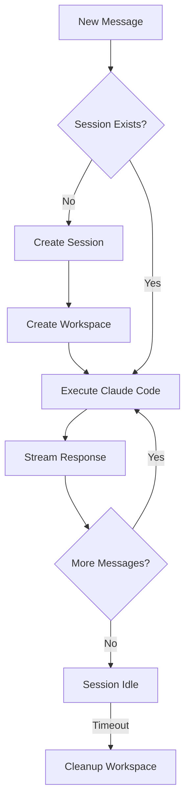

# Architecture Overview

## System Context



## High-Level Architecture



## Request Flow



## Component Details

### Frontend Components

| Component | Location | Purpose |
|-----------|----------|---------|
| ChatWindow | `components/chat/ChatWindow.tsx` | Main chat container |
| ChatMessage | `components/chat/ChatMessage.tsx` | Message bubble |
| ChatInput | `components/chat/ChatInput.tsx` | Input field |
| useChat | `hooks/useChat.ts` | SSE streaming hook |

### Backend Modules

| Module | Location | Purpose |
|--------|----------|---------|
| Agent Driver | `modules/agent/driver.py` | Executes Claude Code CLI |
| Agent Service | `modules/agent/service.py` | Manages prompts & sessions |
| Chat Router | `modules/chat/router.py` | API endpoints |

### Claude Code Driver

The driver wraps Claude Code CLI:

```python
# Simplified flow
async def execute(message, session_id):
    cmd = [
        "claude",
        "--print", message,
        "--output-format", "stream-json",
        "--system-prompt", system_prompt,
    ]
    
    process = await asyncio.create_subprocess_exec(*cmd, ...)
    
    async for line in process.stdout:
        yield parse_event(line)
```

## Session Management



## Data Flow

### Message Format

```typescript
interface ChatMessage {
  id: string;
  role: 'user' | 'assistant';
  content: string;
  timestamp: Date;
  toolUse?: {
    tool: string;
    input: object;
    output?: string;
  }[];
}
```

### SSE Events

```
event: text
data: {"type": "text", "content": "Hello..."}

event: tool_use
data: {"type": "tool_use", "tool": "Bash", "input": {"command": "ls"}}

event: tool_result
data: {"type": "tool_result", "tool": "Bash", "output": "file1 file2"}

event: done
data: {"type": "done"}
```

## Security Considerations

### Workspace Isolation

Each session runs in an isolated directory:

```
/tmp/agent_workspaces/
├── session-uuid-1/
├── session-uuid-2/
└── session-uuid-3/
```

### Tool Restrictions

Control which Claude Code tools are available:

```python
allowed_tools = [
    "Read",      # Read files
    "Write",     # Write files
    "Bash",      # Run commands
    # Omit dangerous tools
]
```

### Timeouts

- Request timeout: 5 minutes default
- Max turns: 10 iterations
- Session cleanup: automatic on end

## Scaling Considerations

### Current Limits

- One Claude Code process per request
- Workspace disk usage per session
- API rate limits

### Future Scaling

- Session pooling
- Workspace caching
- Distributed execution
